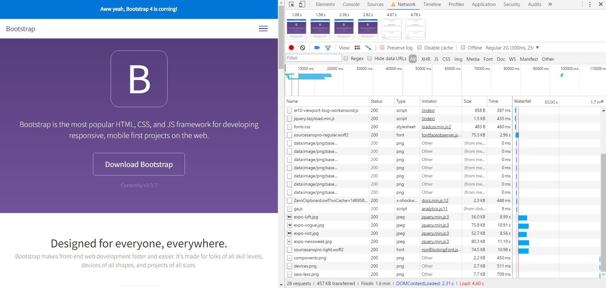
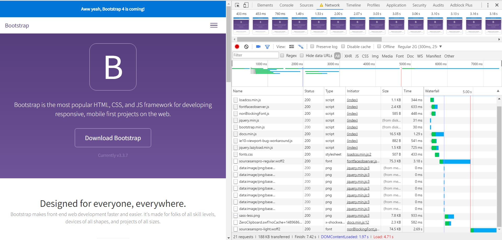

# AUDIT.md

## Webp and Lazyload 16-3-2017
I changed the jpg images to webp. The file size is now smaller. I also changed the lazyload, so the images load when the user is 200px away from the img. It wil allso load in with a fadeIn. This way it looks nice for the user.

## Screenshots - Chrome Development Tools

## Sources
- https://www.appelsiini.net/projects/lazyload
