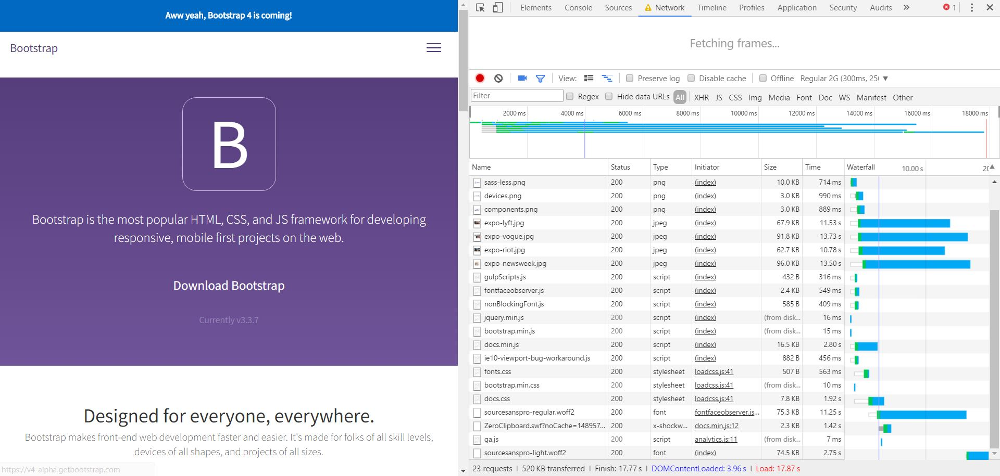

# AUDIT.md

## Gulp Images 15-3-2017
I used Gulp to get the images and minimise them and send them back to the server.

## Screenshots - Chrome Development Tools

## Sources
- https://www.npmjs.com/package/gulp-imagemin
