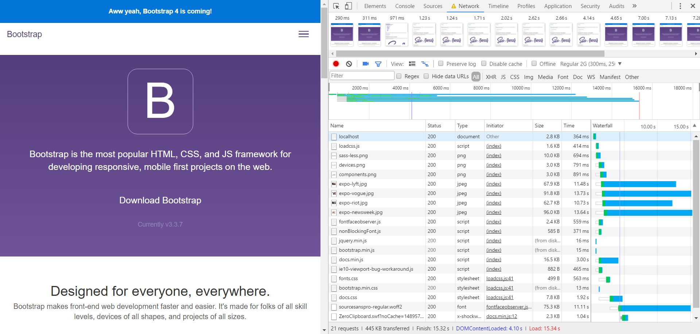

# AUDIT.md

## CDN 15-3-2017
Replaces the local bootstrap and jquery by links to minimized files with a link. This way it will get the link form the internet and it does not have to load it himself.

## Screenshots - Chrome Development Tools

## Sources
- https://www.bootstrapcdn.com/
- https://developers.google.com/speed/libraries/
