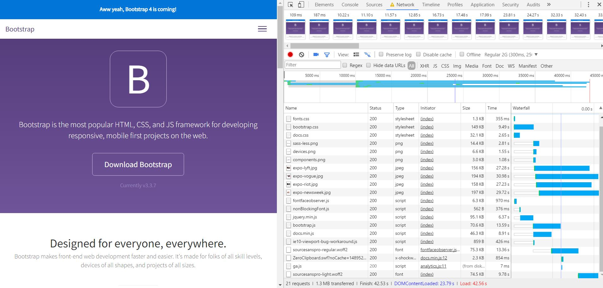
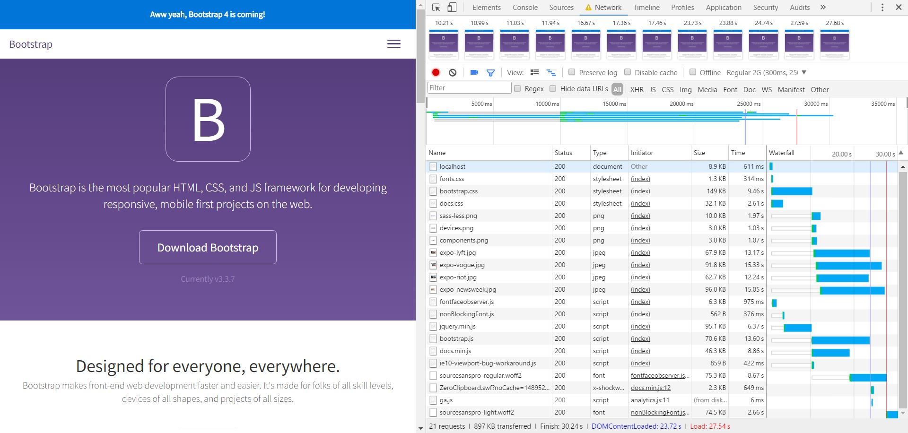
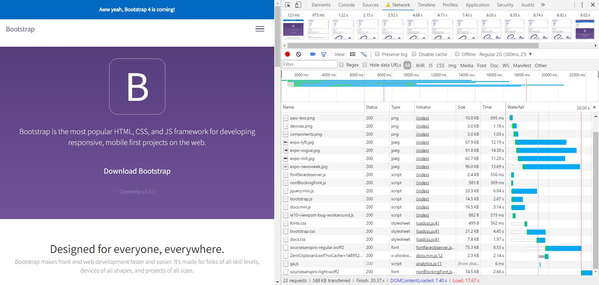

# AUDIT.md

## Compressed Images 14-3-2017
I used http://optimizilla.com/, to compress the images. This way, the file sizes are smaller and this has a possitive effect on the total load time.

## Screenshots - Chrome Development Tools

## Sources
- http://optimizilla.com/
