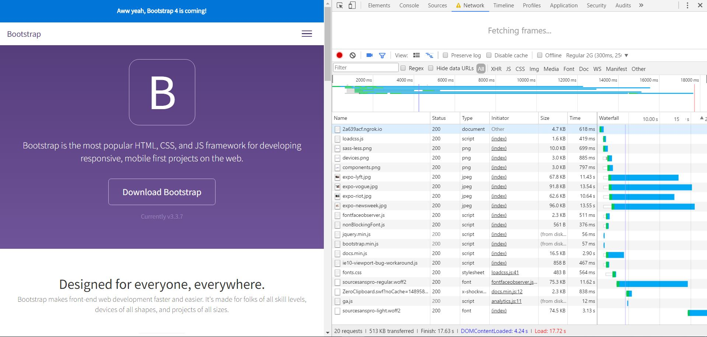
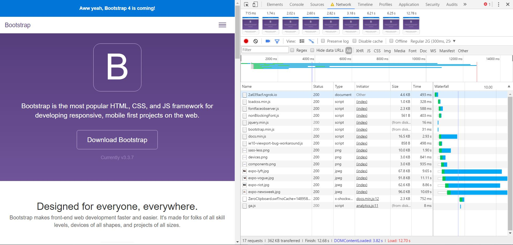

# AUDIT.md

## Non blocking JS and CSS 15-3-2017
I changed the location of the css and js to above the fold and made the JS none blocking
"<head>
    

    
    
    <noscript><link rel="preload" href="/dist/css/fonts.css" as="style"></noscript>

    
    
    
    
    
    
    

    
</head>"

## Screenshots - Chrome Development Tools

## Sources
- Declan Rek : cmd-preformance-matters-2017.pdf
