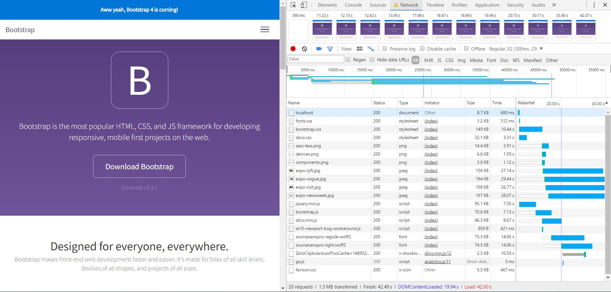

# AUDIT.md

## Fonts enhanced after async loading 13-3-2017
Changes to the html. Added 2 scripts to the html body
```
<body>
    <script src="/assets/js/vendor/fontfaceobserver.js" ></script>
    <script src="/assets/js/vendor/nonBlockingFont.js" ></script>
</body>
```

Changes to the css. This piece of code sets the standard font-family to a system font and when there is a class of fonts-loaded, it changes the a different font-family.

```
    html {
        font-family: Georgia, serif;
    }
    html.fonts-loaded {
        font-family: Noto, Georgia, serif;
    }
```

Added a nonBlockingFont.js script. This code adds a cookie and a class to the html, when the custom font is loaded within 30sec. If not, than the Georgia stays the font or a different serif system font.
```
function createCookie(name, value) {
    document.cookie = `${name}=${value}; path=/`;
}
var html = document.documentElement;
var font = new FontFaceObserver('source_sans_pro');
font.load(null, 30000).then(function () {
    document.documentElement.className += ' fonts-loaded';
    createCookie('fontsLoaded', true);
});
```

##Screenshots - Chrome Development Tools



##Sources
- Declan Rek : cmd-preformance-matters-2017.pdf
